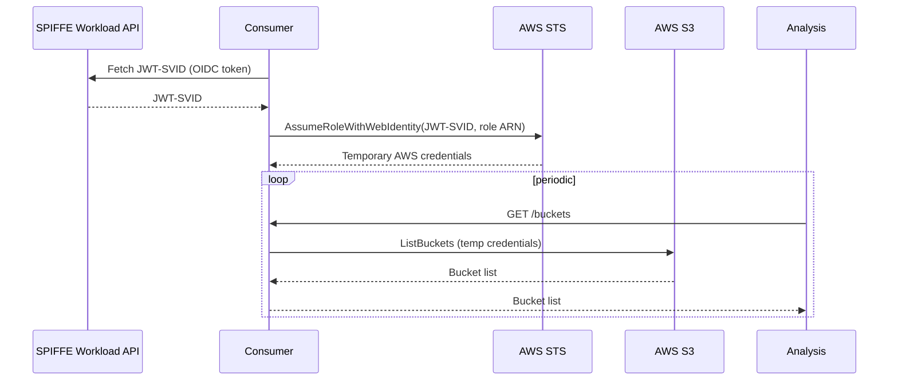

# aws-oidc

Demonstrates using a SPIFFE JWT-SVID to authenticate to AWS via OIDC web identity, exchanging a workload's SPIFFE identity for temporary AWS credentials without static secrets.

## What it demonstrates

The **consumer** workload uses its SPIFFE JWT-SVID as an OIDC token to call AWS STS `AssumeRoleWithWebIdentity`, which returns short-lived AWS credentials scoped to a configured IAM role. It then uses those credentials to call the S3 API and list buckets.

The **analysis** workload periodically calls the consumer's `/buckets` HTTP endpoint and logs the results.

Optionally, the connection between the two workloads can be secured with SPIFFE mTLS (`ENABLE_TLS=true`), in which case each side validates the other's X.509 SVID.

This pattern shows that SPIFFE identity can be used to authenticate to cloud provider APIs, eliminating the need to distribute long-lived AWS access keys to workloads.



### AWS setup

An OIDC identity provider must be configured in AWS IAM pointing at the SPIRE server's JWKS endpoint, and an IAM role must be created with a trust policy that allows `sts:AssumeRoleWithWebIdentity` from the workload's SPIFFE ID. Terraform configuration for this is provided in the `terraform/` directory.

## Configuration

### Consumer (server — `aws-oidc-consumer`)

Runs in the `production` namespace, listens on `:9090`.

| Variable | Required | Default | Description |
|----------|----------|---------|-------------|
| `AWS_ROLE_ARN` | Yes | — | ARN of the IAM role to assume via web identity |
| `ENABLE_TLS` | No | `false` | If `true`, serve mTLS and validate the analysis workload's SVID |
| `ANALYSIS_TRUST_DOMAIN` | No | — | Trust domain of the analysis workload; used to build the expected SPIFFE ID when `ENABLE_TLS` is true |
| `ANALYSIS_SPIFFE_ID` | No | `spiffe://%s/ns/analytics/sa/default` | SPIFFE ID format string for the authorised analysis workload (`%s` is replaced with `ANALYSIS_TRUST_DOMAIN`) |
| `SPIFFE_ENDPOINT_SOCKET` | No | `unix:///spiffe-workload-api/spire-agent.sock` | SPIFFE Workload API socket path |

### Analysis (client — `aws-oidc-analysis`)

Runs in the `analytics` namespace.

| Variable | Required | Default | Description |
|----------|----------|---------|-------------|
| `CONSUMER_SERVER_ADDRESS` | Yes | — | Base URL of the consumer service (e.g. `http://consumer.production:9090`) |
| `ENABLE_TLS` | No | `false` | If `true`, use mTLS and validate the consumer workload's SVID |
| `CONSUMER_TRUST_DOMAIN` | No | — | Trust domain of the consumer workload; used to build the expected SPIFFE ID when `ENABLE_TLS` is true |
| `CONSUMER_SPIFFE_ID` | No | `spiffe://%s/ns/production/sa/default` | SPIFFE ID format string for the authorised consumer workload (`%s` is replaced with `CONSUMER_TRUST_DOMAIN`) |
| `SPIFFE_ENDPOINT_SOCKET` | No | `unix:///spiffe-workload-api/spire-agent.sock` | SPIFFE Workload API socket path |

## Deployment

### AWS infrastructure

```bash
cd terraform
terraform init
terraform apply
```

This creates the OIDC identity provider in IAM and the IAM role. Note the role ARN output for use below.

### Kubernetes workloads

```bash
export COFIDE_DEMOS_IMAGE_TAG=latest
export COFIDE_DEMOS_IMAGE_PREFIX=ghcr.io/cofide/cofide-demos/
export COFIDE_DEMOS_IMAGE_PULL_POLICY=Always
export CONSUMER_AWS_ROLE_ARN=arn:aws:iam::123456789012:role/consumer-role
export ANALYSIS_TRUST_DOMAIN=example.org
export ANALYSIS_SPIFFE_ID=spiffe://%s/ns/analytics/sa/default
export CONSUMER_TRUST_DOMAIN=example.org
export CONSUMER_SERVER_ADDRESS=http://consumer.production:9090
export CONSUMER_SPIFFE_ID=spiffe://%s/ns/production/sa/default
export CONSUMER_SERVICE_TYPE=ClusterIP

envsubst < aws-oidc-consumer/deploy.yaml | kubectl apply -f -
envsubst < aws-oidc-analysis/deploy.yaml | kubectl apply -f -
```

The consumer is deployed to the `production` namespace and the analysis workload to the `analytics` namespace. Both manifests mount the SPIFFE Workload API socket via the `csi.spiffe.io` CSI driver.
