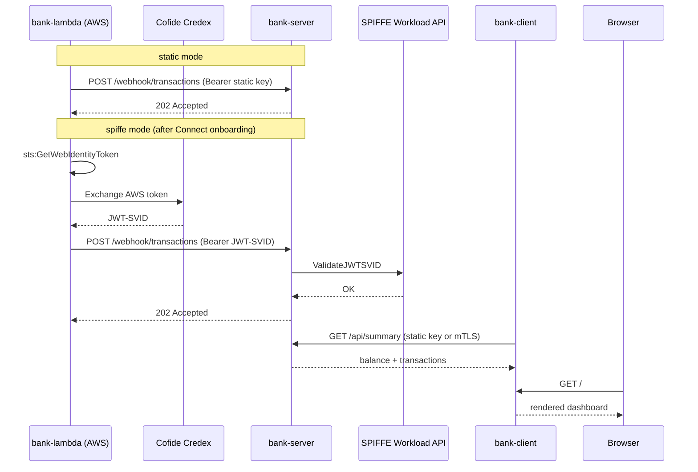

# bank

A more realistic demo than `ping-pong`: a small bank dashboard a customer can view in a browser, with a new transaction pushed in live from an AWS Lambda simulating a payments network webhook. Every hop starts out authenticated with a static, long-lived secret — the world before onboarding into Cofide Connect — and can be toggled to short-lived, SPIFFE-issued identity instead.

Data is static/in-memory only for now; `bank-server` seeds one account and a handful of transactions on startup and resets on restart.

## What it demonstrates

- **`bank-client`**: a tiny Go web server that renders a bank-style HTML dashboard (balance + recent transactions), fetching from `bank-server` on every page load.
- **`bank-server`**: an in-memory ledger with two inbound surfaces — a summary API for `bank-client`, and a webhook for `bank-lambda` to post new transactions.
- **`bank-lambda`**: a Python Lambda, manually invoked to simulate a payments network posting a transaction.

Every hop is controlled by the same `AUTH_MODE` toggle, always presented as `Authorization: Bearer <token>` so handler logic is uniform regardless of mode:

| Hop | `static` (before Connect) | `spiffe` (after onboarding into Connect) |
|---|---|---|
| `bank-client` → `bank-server` | Plain HTTP, bearer pre-shared API key | HTTPS, SPIFFE X.509-SVID mTLS |
| `bank-lambda` → `bank-server` | Plain HTTP, bearer pre-shared API key | Plain HTTP, bearer JWT-SVID minted by **Cofide Credex** |

In `spiffe` mode, `bank-lambda` obtains an AWS web identity token (`sts:GetWebIdentityToken`) and exchanges it with Cofide Credex for a JWT-SVID, which it then presents to `bank-server`. `bank-server` validates that JWT-SVID against its local SPIFFE Workload API, the same way `workloads/ping-pong-jwt`'s server does.



## Configuration

### bank-server

Listens on two ports: `CLIENT_API_ADDRESS` (default `:8443`) for `bank-client`, and `WEBHOOK_ADDRESS` (default `:8444`) for `bank-lambda`.

| Variable | Required | Default | Description |
|---|---|---|---|
| `AUTH_MODE` | No | `static` | `static` or `spiffe` |
| `STATIC_CLIENT_API_KEY` | If `static` | — | Bearer key expected from `bank-client` |
| `STATIC_WEBHOOK_API_KEY` | If `static` | — | Bearer key expected from `bank-lambda` |
| `CLIENT_SPIFFE_ID` | If `spiffe` | — | Authorised SPIFFE ID for `bank-client` |
| `LAMBDA_SPIFFE_ID` | If `spiffe` | — | Authorised SPIFFE ID (JWT-SVID subject) for `bank-lambda` |
| `SPIFFE_ENDPOINT_SOCKET` | No | `unix:///spiffe-workload-api/spire-agent.sock` | SPIFFE Workload API socket path |

### bank-client

| Variable | Required | Default | Description |
|---|---|---|---|
| `AUTH_MODE` | No | `static` | `static` or `spiffe` |
| `LISTEN_ADDRESS` | No | `:8080` | Address the dashboard is served on |
| `BANK_SERVER_SERVICE_HOST` / `BANK_SERVER_SERVICE_PORT` | No | `bank-server-api` / `8443` | `bank-server`'s client-facing API |
| `STATIC_CLIENT_API_KEY` | If `static` | — | Bearer key sent to `bank-server` |
| `SERVER_SPIFFE_ID` | If `spiffe` | — | Expected SPIFFE ID of `bank-server` |
| `SPIFFE_ENDPOINT_SOCKET` | No | `unix:///spiffe-workload-api/spire-agent.sock` | SPIFFE Workload API socket path |

### bank-lambda

| Variable | Required | Default | Description |
|---|---|---|---|
| `AUTH_MODE` | No | `static` | `static` or `spiffe` |
| `BANK_SERVER_WEBHOOK_URL` | Yes | — | Full URL of `bank-server`'s webhook, reachable from AWS |
| `STATIC_WEBHOOK_API_KEY` | If `static` | — | Bearer key sent to `bank-server` |
| `TOKEN_EXCHANGE_URL` | If `spiffe` | — | Cofide Credex token exchange endpoint |
| `CREDEX_AUDIENCE` | No | `cofide-credex` | Audience requested on the AWS web identity token |

Invoke manually to simulate a new transaction:

```bash
aws lambda invoke --function-name cofide-bank-demo-lambda \
  --payload '{"merchant": "Rail Delivery Group", "category": "Transport", "amountPence": -3450}' \
  --cli-binary-format raw-in-base64-out out.json
```

Omit `--payload` to post a canned default transaction.

## Deployment

### Using the scripts (recommended for a live demo)

`scripts/deploy-static.sh` and `scripts/toggle-spiffe.sh` wrap the Helm and Terraform steps below into two commands. Both auto-detect the `bank-server-webhook` URL from the cluster if you don't pass `--webhook-url` explicitly, and both support `--skip-helm`/`--skip-terraform` if you only want to drive one half.

`--kube-context <name>` is required on both scripts — the target cluster must always be explicit rather than relying on whatever `kubectl config use-context` happened to be set beforehand.

Both scripts default to a dedicated `bank` namespace (created automatically by `deploy-static.sh`) rather than deploying into `default`, matching how a real application would be namespaced. Override with `--namespace <ns>` if you want something else — just pass the same value to both scripts.

`toggle-spiffe.sh` only needs the SPIFFE-related flags, not a repeat of `deploy-static.sh`'s image/service-type/etc. flags — its `helm upgrade` uses `--reuse-values` to carry those forward from your last `deploy-static.sh` run. (Without `--reuse-values`, `helm upgrade --set ...` resets every value you don't re-specify back to the chart's defaults — a well-known Helm gotcha, not something specific to this chart.)

If you're deploying with `image.prefix=ko.local/` (the default), `deploy-static.sh` also auto-detects a `kind` cluster from your current `kubectl` context and runs `kind load docker-image` before installing — `ko build` with `KO_DOCKER_REPO=ko.local` only loads images into your host Docker daemon, which a `kind` cluster's containerd can't see on its own (this shows up as `ErrImageNeverPull` if skipped). Override with `--kind-cluster <name>`, or turn it off with `--skip-kind-load`.

#### Exposing the webhook from a local kind cluster

A `kind` cluster has no real cloud load balancer, so `--webhook-service-type LoadBalancer` only works against a real cluster (EKS/GKE/etc.) — on `kind` it'll sit at `<pending>` forever. On `kind`, use `NodePort` with a fixed port plus a tunnel (e.g. a named Cloudflare Tunnel) instead:

1. Add an `extraPortMappings` entry for your chosen port (e.g. `30052`) to your `kind` cluster's config, and recreate the cluster — `kind` can't add port mappings to a running cluster.
2. Add a matching ingress rule to your `cloudflared` tunnel config, e.g.:
   ```yaml
   - hostname: aw-bank-webhook.cofide.dev
     service: http://localhost:30052
   ```
3. Deploy with `--webhook-service-type NodePort --webhook-node-port 30052`, and pass `--webhook-url https://aw-bank-webhook.cofide.dev/webhook/transactions` explicitly — auto-detection only makes sense for `LoadBalancer`/`ClusterIP`, since for `NodePort` the actual reachable-from-AWS address is your tunnel's public hostname, not anything `kubectl get svc` can report.

```bash
cd workloads/bank

# Build images first (from the repo root): just build-bank

./scripts/deploy-static.sh \
  --kube-context <your-kubectl-context> \
  --client-api-key <client-key> \
  --webhook-api-key <webhook-key> \
  --aws-region <region> \
  --webhook-service-type NodePort \
  --webhook-node-port 30052 \
  --webhook-url https://aw-bank-webhook.cofide.dev/webhook/transactions
  # Real cloud cluster instead of local kind? Use --webhook-service-type LoadBalancer and drop
  # --webhook-node-port / --webhook-url (the LoadBalancer address auto-detects).
```

Once you've onboarded the cluster into Cofide Connect and have a reachable Credex instance:

```bash
./scripts/toggle-spiffe.sh \
  --kube-context <your-kubectl-context> \
  --server-spiffe-id spiffe://<trust-domain>/bank/server \
  --client-spiffe-id spiffe://<trust-domain>/bank/client \
  --lambda-spiffe-id spiffe://<trust-domain>/bank/lambda \
  --credex-url <cofide-credex-token-exchange-url> \
  --aws-region <region>
```

Run either script with `--help` for the full flag list. They call `terraform apply` interactively (no `-auto-approve`), so you'll see and confirm the plan before anything changes.

### Manual steps (what the scripts do)

#### 1. Kubernetes workloads (static mode)

```bash
helm install bank ./chart/bank \
  --namespace bank --create-namespace \
  --set image.prefix=ko.local/ \
  --set image.tag=latest \
  --set image.pullPolicy=Never \
  --set staticAuth.clientApiKey=<client-key> \
  --set staticAuth.webhookApiKey=<webhook-key> \
  --set server.webhookServiceType=LoadBalancer
```

`server.webhookServiceType` needs to resolve to something reachable from AWS for `bank-lambda` to call — `ClusterIP` is fine for `bank-client` (same cluster) but not for the Lambda hop outside a local `kind` cluster. Deploying into a dedicated `bank` namespace (rather than `default`) matches how a real application would be namespaced.

View the dashboard with `kubectl -n bank port-forward svc/bank-client 8080:8080` and open `http://localhost:8080`.

#### 2. AWS Lambda (static mode)

```bash
cd terraform
terraform init
terraform apply \
  -var auth_mode=static \
  -var bank_server_webhook_url=http://<bank-server-webhook-address>:8444/webhook/transactions \
  -var static_webhook_api_key=<webhook-key>
```

#### 3. Toggle to SPIFFE (after onboarding into Connect)

Requires a cluster with SPIRE/Cofide Connect and the `csi.spiffe.io` CSI driver installed, as with every other SPIFFE demo in this repo, and the three SPIFFE IDs below already registered in your trust zone/Credex config (that registration happens outside this repo).

```bash
helm upgrade bank ./chart/bank \
  --namespace bank \
  --reuse-values \
  --set authMode=spiffe \
  --set spiffe.serverSpiffeId=spiffe://<trust-domain>/bank/server \
  --set spiffe.clientSpiffeId=spiffe://<trust-domain>/bank/client \
  --set spiffe.lambdaSpiffeId=spiffe://<trust-domain>/bank/lambda

kubectl -n bank rollout restart deployment/bank-server deployment/bank-client

cd terraform
terraform apply \
  -var auth_mode=spiffe \
  -var bank_server_webhook_url=http://<bank-server-webhook-address>:8444/webhook/transactions \
  -var token_exchange_url=<cofide-credex-token-exchange-url>
```

Invoke `bank-lambda` again and reload the dashboard — the header badge flips from "Connected via static secret" to "Connected via SPIFFE".
