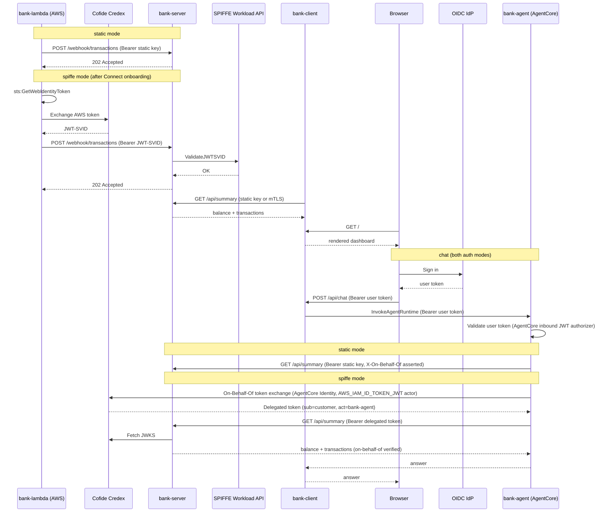

# bank

A more realistic demo than `ping-pong`: a small bank dashboard a customer can view in a browser, with a new transaction pushed in live from an AWS Lambda simulating a payments network webhook, and an AI spending-insights assistant the customer can chat with. Every hop starts out authenticated with a static, long-lived secret — the world before onboarding into Cofide Connect — and can be toggled to short-lived, SPIFFE-issued identity instead.

Data is static/in-memory only for now; `bank-server` seeds one account and a handful of transactions on startup and resets on restart.

See [`docs/agentcore-identity.md`](docs/agentcore-identity.md) for a deeper comparison between `bank-agent`'s use of Credex and AWS Bedrock AgentCore's own native identity/delegation features — useful background for demo Q&A.

## What it demonstrates

- **`bank-client`**: a tiny Go web server that renders a bank-style HTML dashboard (balance + recent transactions), fetching from `bank-server` on every page load. Also handles OIDC sign-in and proxies chat questions to `bank-agent`.
- **`bank-server`**: an in-memory ledger with three inbound surfaces — a summary API for `bank-client`, a webhook for `bank-lambda` to post new transactions, and a separate summary API for `bank-agent`.
- **`bank-lambda`**: a Python Lambda, manually invoked to simulate a payments network posting a transaction.
- **`bank-agent`**: a Python AI agent hosted on AWS Bedrock AgentCore that answers a signed-in customer's questions about their account. Extends the "every hop gets its own identity" story to an AI agent, and specifically demonstrates that Cofide Credex remains necessary even for a workload built entirely from AWS-native primitives (AgentCore Identity's own On-Behalf-Of token exchange) — see `docs/agentcore-identity.md` for the full comparison. A core part of the demo, deployed by the same scripts as everything else — see "bank-agent + OIDC bootstrap (one-time)" below for its one extra bootstrap requirement (its container image must exist before it can be deployed).

Every hop is controlled by the same `AUTH_MODE` toggle, always presented as `Authorization: Bearer <token>` so handler logic is uniform regardless of mode:

| Hop | `static` (before Connect) | `spiffe` (after onboarding into Connect) |
|---|---|---|
| `bank-client` → `bank-server` | Plain HTTP, bearer pre-shared API key | HTTPS, SPIFFE X.509-SVID mTLS |
| `bank-lambda` → `bank-server` | Plain HTTP, bearer pre-shared API key | Plain HTTP, bearer JWT-SVID minted by **Cofide Credex** |
| `bank-agent` → `bank-server` | Plain HTTP, bearer pre-shared API key + asserted `X-On-Behalf-Of` header | Plain HTTP, bearer delegated token minted by **Cofide Credex**'s On-Behalf-Of exchange, verified `sub` (customer) claim |

In `spiffe` mode, `bank-lambda` obtains an AWS web identity token (`sts:GetWebIdentityToken`) and exchanges it with Cofide Credex for a JWT-SVID, which it then presents to `bank-server`. `bank-server` validates that JWT-SVID against its local SPIFFE Workload API, the same way `workloads/ping-pong-jwt`'s server does.

Signing in to chat with `bank-agent` is a separate, orthogonal axis handled by an **OIDC IdP** (Ory, Auth0, Okta, ... — nothing in this integration is IdP-specific), independent of `AUTH_MODE` — a customer logs in via `bank-client` in both modes; what changes is only how `bank-agent` proves its own identity to `bank-server` afterwards. In `spiffe` mode this becomes a genuine delegated call: Credex mints a token with the customer as subject and `bank-agent` as actor (RFC 8693), and `bank-server` logs the customer identity as cryptographically *verified* rather than merely *asserted*.



## Configuration

### bank-server

Listens on two ports: `CLIENT_API_ADDRESS` (default `:8443`) for `bank-client`, and `WEBHOOK_ADDRESS` (default `:8444`) — shared by `bank-lambda` and `bank-agent`, on different routes (`/webhook/transactions`, `/api/summary`) with different auth middleware. They share a listener because neither uses mTLS (both are already plain-HTTP bearer-token surfaces, unlike the client listener), and consolidating means only one port/NodePort/tunnel entry to expose from AWS, instead of one per AWS-hosted caller.

The agent-related variables below are optional even in their "if" mode — `bank-agent`'s Terraform can't be applied until `bank-server` is already running (see "bank-agent + OIDC bootstrap (one-time)" below), so `bank-server` must be able to start with the `/api/summary` route on this listener simply not registered during that brief bootstrap window, even though bank-agent is a permanent, non-optional part of the deployed demo.

| Variable | Required | Default | Description |
|---|---|---|---|
| `AUTH_MODE` | No | `static` | `static` or `spiffe` |
| `STATIC_CLIENT_API_KEY` | If `static` | — | Bearer key expected from `bank-client` |
| `STATIC_WEBHOOK_API_KEY` | If `static` | — | Bearer key expected from `bank-lambda` |
| `STATIC_AGENT_API_KEY` | No | — | Bearer key expected from `bank-agent`; its route isn't registered if unset |
| `CLIENT_SPIFFE_ID` | If `spiffe` | — | Authorised SPIFFE ID for `bank-client` |
| `LAMBDA_SPIFFE_ID` | If `spiffe` | — | Authorised SPIFFE ID (JWT-SVID subject) for `bank-lambda` |
| `AGENT_AUTHORIZED_ACTOR` | No | — | Authorised actor (delegated token's `act.sub`) for `bank-agent` — not a SPIFFE ID, since `bank-agent` is an AgentCore Runtime workload with no SPIFFE identity; it's the AWS IAM execution role ARN that ends up there (see `terraform output bank_agent_execution_role_arn`). Its route isn't registered if unset |
| `CREDEX_DISCOVERY_URL` | No | — | Credex OIDC discovery URL, used to fetch the JWKS that validates `bank-agent`'s delegated tokens; its route isn't registered if unset |
| `AGENT_TOKEN_AUDIENCE` | No | `bank-server-agent-api` | Expected `aud` claim on `bank-agent`'s delegated tokens |
| `SPIFFE_ENDPOINT_SOCKET` | No | `unix:///spiffe-workload-api/spire-agent.sock` | SPIFFE Workload API socket path |

### bank-client

OIDC sign-in and the `bank-agent` chat proxy are independent of `AUTH_MODE` — signing in is orthogonal to the static/SPIFFE toggle. `OIDC_DISCOVERY_URL` and `BANK_AGENT_INVOKE_URL` aren't `mustGetEnv`-required, purely so `bank-client` can still boot before `terraform/bootstrap` (which registers the OIDC client) and bank-agent's own Terraform (which produces the invoke URL) have both run — `deploy-static.sh` wires both in automatically as part of its normal flow, so in practice they're always set.

| Variable | Required | Default | Description |
|---|---|---|---|
| `AUTH_MODE` | No | `static` | `static` or `spiffe` |
| `LISTEN_ADDRESS` | No | `:8080` | Address the dashboard is served on |
| `BANK_SERVER_SERVICE_HOST` / `BANK_SERVER_SERVICE_PORT` | No | `bank-server-api` / `8443` | `bank-server`'s client-facing API |
| `STATIC_CLIENT_API_KEY` | If `static` | — | Bearer key sent to `bank-server` |
| `SERVER_SPIFFE_ID` | If `spiffe` | — | Expected SPIFFE ID of `bank-server` |
| `SPIFFE_ENDPOINT_SOCKET` | No | `unix:///spiffe-workload-api/spire-agent.sock` | SPIFFE Workload API socket path |
| `OIDC_DISCOVERY_URL` | No | — | OIDC discovery URL (any compliant IdP); chat disabled if unset |
| `OIDC_CLIENT_ID` | If chat enabled | — | OAuth2 client ID — `bank-client` is a public OAuth2 client (PKCE, no secret) |
| `OIDC_REDIRECT_URL` | If chat enabled | — | OAuth2 redirect URL, e.g. `https://<dashboard-host>/callback` |
| `BANK_AGENT_INVOKE_URL` | No | — | `bank-agent`'s AgentCore Runtime invoke URL; chat disabled if unset |
| `SESSION_SECRET` | No | random, generated at startup | Signs the session cookie; set explicitly so sessions survive a restart |

### bank-lambda

| Variable | Required | Default | Description |
|---|---|---|---|
| `AUTH_MODE` | No | `static` | `static` or `spiffe` |
| `BANK_SERVER_WEBHOOK_URL` | Yes | — | Full URL of `bank-server`'s webhook, reachable from AWS |
| `STATIC_WEBHOOK_API_KEY` | If `static` | — | Bearer key sent to `bank-server` |
| `TOKEN_EXCHANGE_URL` | If `spiffe` | — | Cofide Credex token exchange endpoint |
| `CREDEX_AUDIENCE` | No | `bank-server-webhook` | Audience requested on the AWS web identity token — Credex's bespoke exchange mints the resulting JWT-SVID's audience as a pass-through of this value, so it must match bank-server's `webhookAudience` constant |

Invoke manually to simulate a new transaction:

```bash
aws lambda invoke --function-name cofide-bank-demo-lambda \
  --payload '{"merchant": "Rail Delivery Group", "category": "Transport", "amountPence": -3450}' \
  --cli-binary-format raw-in-base64-out out.json
```

Omit `--payload` to post a canned default transaction.

### bank-agent

Hosted on AWS Bedrock AgentCore Runtime, not in this cluster — see "bank-agent + OIDC bootstrap (one-time)" below for its one extra bootstrap requirement (its ECR image). Configured entirely via Terraform (`terraform/agentcore.tf`), not Helm.

| Variable | Required | Default | Description |
|---|---|---|---|
| `AUTH_MODE` | No | `static` | `static` or `spiffe` |
| `BANK_SERVER_SUMMARY_URL` | Yes | — | Full URL of `bank-server`'s agent-facing summary endpoint, reachable from AWS |
| `BEDROCK_MODEL_ID` | No | `anthropic.claude-sonnet-5-20260101-v1:0` | Bedrock model used to answer questions |
| `STATIC_AGENT_API_KEY` | If `static` | — | Bearer key sent to `bank-server` |
| `CREDEX_PROVIDER_NAME` | If `spiffe` | — | Name of the AgentCore OAuth2 Credential Provider registered for Credex |

Inbound auth (validating the signed-in customer's OIDC token) is configured on the AgentCore Runtime resource itself (`authorizer_configuration`), not via environment variables — see `docs/agentcore-identity.md`.

## Deployment

### Using the scripts (recommended for a live demo)

`scripts/deploy-static.sh` and `scripts/toggle-spiffe.sh` wrap the Helm and Terraform steps below into two commands, including creating and wiring up `bank-agent` and auto-detecting its OIDC client from `terraform/bootstrap` (run `--help` on either for the full flag list). The one thing they don't do is that one-time `terraform/bootstrap` apply itself (ECR repo + OIDC client registration) — see "bank-agent + OIDC bootstrap (one-time)" below, and do that before your first `deploy-static.sh` run. Both auto-detect the `bank-server-webhook` URL from the cluster if you don't pass `--webhook-url` explicitly, and both support `--skip-helm`/`--skip-terraform` if you only want to drive one half.

`--kube-context <name>` is required on both scripts — the target cluster must always be explicit rather than relying on whatever `kubectl config use-context` happened to be set beforehand.

Both scripts default to a dedicated `bank` namespace (created automatically by `deploy-static.sh`) rather than deploying into `default`, matching how a real application would be namespaced. Override with `--namespace <ns>` if you want something else — just pass the same value to both scripts.

`toggle-spiffe.sh` only needs the SPIFFE-related flags, not a repeat of `deploy-static.sh`'s image/service-type/etc. flags — its `helm upgrade` uses `--reuse-values` to carry those forward from your last `deploy-static.sh` run. (Without `--reuse-values`, `helm upgrade --set ...` resets every value you don't re-specify back to the chart's defaults — a well-known Helm gotcha, not something specific to this chart.)

If you're deploying with `image.prefix=ko.local/` (the default), `deploy-static.sh` also auto-detects a `kind` cluster from your current `kubectl` context and runs `kind load docker-image` before installing — `ko build` with `KO_DOCKER_REPO=ko.local` only loads images into your host Docker daemon, which a `kind` cluster's containerd can't see on its own (this shows up as `ErrImageNeverPull` if skipped). Override with `--kind-cluster <name>`, or turn it off with `--skip-kind-load`.

#### Exposing the webhook from a local kind cluster

A `kind` cluster has no real cloud load balancer, so `--webhook-service-type LoadBalancer` only works against a real cluster (EKS/GKE/etc.) — on `kind` it'll sit at `<pending>` forever. On `kind`, use `NodePort` with a fixed port plus a tunnel (e.g. a named Cloudflare Tunnel) instead:

1. Add an `extraPortMappings` entry for your chosen port (e.g. `30052`) to your `kind` cluster's config, and recreate the cluster — `kind` can't add port mappings to a running cluster.
2. Add a matching ingress rule to your `cloudflared` tunnel config, e.g.:
   ```yaml
   - hostname: aw-bank-webhook.cofide.dev
     service: http://localhost:30052
   ```
3. Deploy with `--webhook-service-type NodePort --webhook-node-port 30052`, and pass `--webhook-url https://aw-bank-webhook.cofide.dev/webhook/transactions` explicitly — auto-detection only makes sense for `LoadBalancer`/`ClusterIP`, since for `NodePort` the actual reachable-from-AWS address is your tunnel's public hostname, not anything `kubectl get svc` can report.

This one tunnel ingress rule covers both `bank-lambda` and `bank-agent` — they share the same Service/port (just different routes), so `deploy-static.sh`/`toggle-spiffe.sh` derive bank-agent's URL from `--webhook-url` by swapping the path (`/api/summary` instead of `/webhook/transactions`); there's no second port/tunnel entry to add for it.

```bash
cd workloads/bank

# Build images first (from the repo root): just build-bank

./scripts/deploy-static.sh \
  --kube-context <your-kubectl-context> \
  --client-api-key <client-key> \
  --webhook-api-key <webhook-key> \
  --aws-region <region> \
  --webhook-service-type NodePort \
  --webhook-node-port 30052 \
  --webhook-url https://aw-bank-webhook.cofide.dev/webhook/transactions
  # Real cloud cluster instead of local kind? Use --webhook-service-type LoadBalancer and drop
  # --webhook-node-port / --webhook-url (the LoadBalancer address auto-detects).
```

Once you've onboarded the cluster into Cofide Connect and have a reachable Credex instance:

```bash
./scripts/toggle-spiffe.sh \
  --kube-context <your-kubectl-context> \
  --server-spiffe-id spiffe://<trust-domain>/bank/server \
  --client-spiffe-id spiffe://<trust-domain>/bank/client \
  --lambda-spiffe-id spiffe://<trust-domain>/bank/lambda \
  --credex-url <cofide-credex-token-exchange-url> \
  --aws-region <region>
```

Run either script with `--help` for the full flag list. They call `terraform apply` interactively (no `-auto-approve`), so you'll see and confirm the plan before anything changes.

### Manual steps (what the scripts do)

#### 1. bank-agent + OIDC bootstrap (one-time)

Two independent prerequisites live in `terraform/bootstrap`, applied together because both have to exist before the steps that follow:

- `bank-agent`'s container image has to already exist in ECR before step 3 can succeed — `CreateAgentRuntime` requires the image to exist at the given tag, and the ECR repo can't be managed in the same Terraform module (or `apply`) as the Agent Runtime that references it.
- `bank-client`'s OIDC OAuth2 client has to be registered before step 2's Helm install, which needs its client ID and discovery URL as pod env vars at start time.

This assumes an Ory Network project already exists, with Google already configured as a social sign-in provider in it — that federation isn't managed here, it's an existing prerequisite (see `terraform/bootstrap/variables.tf`). Signing in during a demo just means using a real Google account through Ory's hosted login UI; there's no separate Ory-native test identity to create.

```bash
export ORY_PROJECT_API_KEY=ory_pat_...   # from the Ory Console/CLI — never put this in a tfvars file

cd terraform/bootstrap
terraform init -input=false
terraform apply -var-file=vars.tfvars   # edit vars.tfvars first: aws_region, ory_project_slug,
                                         # oidc_redirect_url

cd ../..
./scripts/build-bank-agent.sh
```

#### 2. Kubernetes workloads (static mode)

```bash
helm install bank ./chart/bank \
  --namespace bank --create-namespace \
  --set image.prefix=ko.local/ \
  --set image.tag=latest \
  --set image.pullPolicy=Never \
  --set staticAuth.clientApiKey=<client-key> \
  --set staticAuth.webhookApiKey=<webhook-key> \
  --set staticAuth.agentApiKey=<agent-key> \
  --set server.webhookServiceType=LoadBalancer \
  --set oidc.discoveryUrl="$(terraform -chdir=terraform/bootstrap output -raw oidc_discovery_url)" \
  --set oidc.clientId="$(terraform -chdir=terraform/bootstrap output -raw oidc_client_id)" \
  --set oidc.redirectUrl="$(terraform -chdir=terraform/bootstrap output -raw oidc_redirect_url)"
```

`bank-client` is registered as a public OAuth2 client (PKCE, no client secret — `token_endpoint_auth_method: none`) by step 1's Terraform, one less static secret to manage and consistent with the rest of this demo's "away from static secrets" theme.

`server.webhookServiceType` needs to resolve to something reachable from AWS for `bank-lambda`/`bank-agent` to call — `ClusterIP` is fine for `bank-client` (same cluster, its own `clientApiPort`) but not for those two AWS-hosted callers outside a local `kind` cluster. `bank-lambda` and `bank-agent` share this one Service/port (different routes, different auth), so there's only this one to expose — not one per caller. Deploying into a dedicated `bank` namespace (rather than `default`) matches how a real application would be namespaced.

View the dashboard with `kubectl -n bank port-forward svc/bank-client 8080:8080` and open `http://localhost:8080`.

#### 3. AWS Lambda and bank-agent (static mode)

```bash
cd terraform
terraform init
terraform apply \
  -var auth_mode=static \
  -var bank_server_webhook_url=http://<bank-server-webhook-address>:8444/webhook/transactions \
  -var static_webhook_api_key=<webhook-key> \
  -var bank_server_agent_api_url=http://<bank-server-webhook-address>:8444/api/summary \
  -var static_agent_api_key=<agent-key> \
  -var oidc_discovery_url="$(terraform -chdir=bootstrap output -raw oidc_discovery_url)" \
  -var "oidc_allowed_clients=[\"$(terraform -chdir=bootstrap output -raw oidc_client_id)\"]"
```

Then wire the invoke URL Terraform just produced into the dashboard so the chat panel appears:

```bash
helm upgrade bank ./chart/bank --namespace bank --reuse-values \
  --set bankAgent.invokeUrl="$(terraform output -raw bank_agent_invoke_url)"
kubectl -n bank rollout restart deployment/bank-client
```

#### 4. Toggle to SPIFFE (after onboarding into Connect)

Requires a cluster with SPIRE/Cofide Connect and the `csi.spiffe.io` CSI driver installed, as with every other SPIFFE demo in this repo, and the three SPIFFE IDs below already registered in your trust zone/Credex config (that registration happens outside this repo). `bank-agent` has no SPIFFE identity of its own (it's an AgentCore Runtime workload, not a k8s pod) — its authorized-actor value is its IAM execution role ARN, auto-detected from `terraform`'s own output below rather than registered anywhere.

```bash
helm upgrade bank ./chart/bank \
  --namespace bank \
  --reuse-values \
  --set authMode=spiffe \
  --set spiffe.serverSpiffeId=spiffe://<trust-domain>/bank/server \
  --set spiffe.clientSpiffeId=spiffe://<trust-domain>/bank/client \
  --set spiffe.lambdaSpiffeId=spiffe://<trust-domain>/bank/lambda \
  --set spiffe.agentAuthorizedActor="$(terraform -chdir=terraform output -raw bank_agent_execution_role_arn)" \
  --set credex.discoveryUrl=<cofide-credex-oidc-discovery-url, full form ending in /.well-known/openid-configuration>

kubectl -n bank rollout restart deployment/bank-server deployment/bank-client

cd terraform
terraform apply \
  -var auth_mode=spiffe \
  -var bank_server_webhook_url=http://<bank-server-webhook-address>:8444/webhook/transactions \
  -var token_exchange_url=<cofide-credex-token-exchange-url> \
  -var bank_server_agent_api_url=http://<bank-server-webhook-address>:8444/api/summary \
  -var oidc_discovery_url="$(terraform -chdir=bootstrap output -raw oidc_discovery_url)" \
  -var "oidc_allowed_clients=[\"$(terraform -chdir=bootstrap output -raw oidc_client_id)\"]" \
  -var credex_discovery_url=<cofide-credex-oidc-discovery-url, full form ending in /.well-known/openid-configuration>
```

Invoke `bank-lambda` again and reload the dashboard — the header badge flips from "Connected via static secret" to "Connected via SPIFFE". See `docs/agentcore-identity.md` for the mechanics of `bank-agent`'s Credex integration.

## Logs dashboard

`just bank-logs-dashboard` runs a small local web page (`workloads/bank/logs-dashboard`)
that tails all four workloads' logs side by side — `bank-client`/`bank-server` via
`kubectl logs -f`, `bank-lambda`/`bank-agent` via CloudWatch — so a live demo doesn't
need switching between terminal tabs and the CloudWatch console. It requires no new
infrastructure: it just runs read-only `kubectl`/CloudWatch calls locally using
whatever kube-context and AWS credentials you already have active. See
`workloads/bank/logs-dashboard --help` (or `just bank-logs-dashboard -- --help`) for
overriding the kube-context, deployment names, Lambda function name, or agent log
group if your deployment doesn't use the Terraform defaults.
