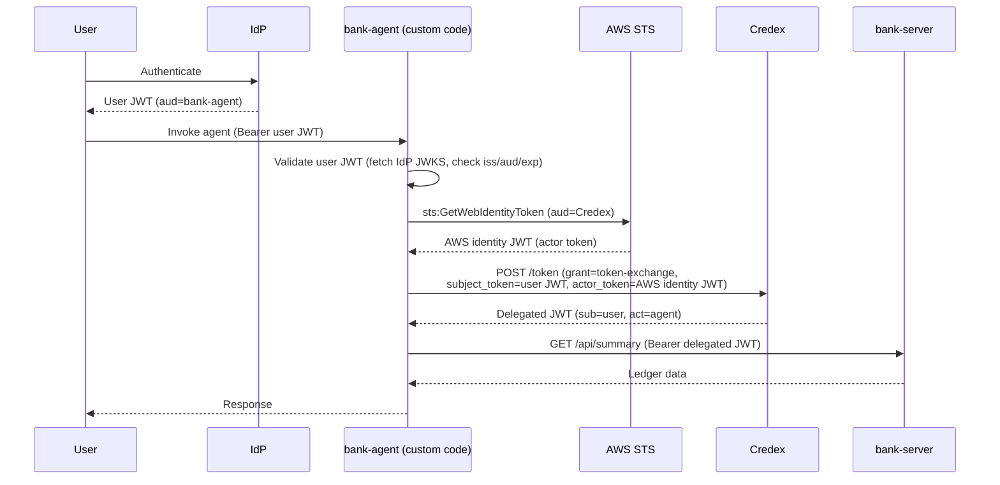
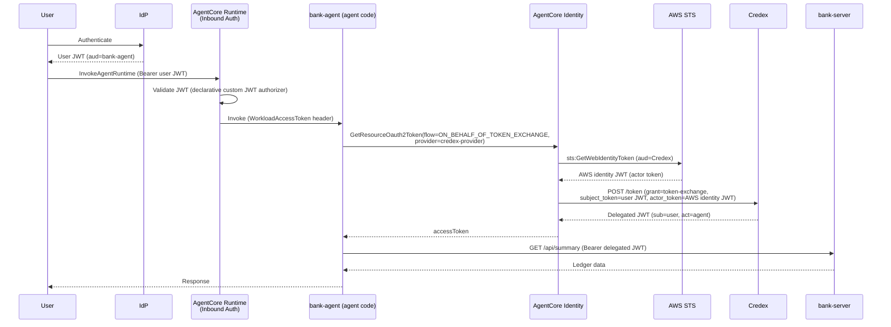

# AWS Bedrock AgentCore Identity/Gateway, and where Credex still fits in

Notes from scoping out a possible `bank-agent` workload (an AI agent hosted on
AWS Bedrock AgentCore) for the `bank` demo. Written up for demo Q&A prep, not
as an implementation plan.

## TL;DR

AWS Bedrock AgentCore Identity has a built-in delegated token-exchange
feature ("On-Behalf-Of token exchange") that follows the same RFC 8693 shape
as a Cofide Credex delegated exchange: exchange an inbound user token plus
proof of the agent's own identity for a new token with the user as subject
and the agent as actor.

**Credex is not replaced by this.** AgentCore's feature is a client of an
OAuth2 token-exchange endpoint — Credex would be that endpoint. What changes
is *who calls Credex and how*: without AgentCore, an agent's own code has to
fetch an identity token and POST to Credex by hand; with AgentCore, that
becomes declarative configuration (an "OAuth2 Credential Provider") plus one
SDK call, and AWS does the STS call and the token-exchange request for you.

## Background: the delegated flow we already use with Credex

`bank-lambda` already does the non-delegated version of this (its own
identity only, no user in the loop): exchange an AWS-issued identity token
for a JWT-SVID via Credex, then call `bank-server`. The delegated version —
relevant to an agent acting on behalf of a signed-in user — adds a subject:

1. A user authenticates via their IdP and gets a token audienced for the
   agent (not usable directly against any downstream resource server).
2. The agent validates that token.
3. To call a downstream service, the agent asks Credex to exchange **its own
   workload identity (SVID) + the user's token** for a new token with the
   user as `sub` and the agent as `act` (RFC 8693 delegation).
4. The agent presents that Credex-minted token to the downstream service.

## AgentCore Identity building blocks

- **Inbound Auth** — controls who can invoke the agent: either IAM SigV4, or
  a custom JWT authorizer (OIDC discovery URL + allowed audiences/clients/
  scopes), configured declaratively on the Runtime. This is step 1/2 above,
  done for you.
- **Workload identity** — every AgentCore Runtime agent gets one
  automatically; it's the anchor AgentCore Identity uses to broker
  credentials on the agent's behalf.
- **OAuth2 Credential Provider** — a registered downstream target (discovery
  URL, client id/secret, and an on-behalf-of token exchange config). Credex
  would be registered here.
- **On-Behalf-Of (OBO) token exchange** — `GetResourceOauth2Token` with
  `oauth2Flow=ON_BEHALF_OF_TOKEN_EXCHANGE` performs an RFC 8693 exchange
  against the configured provider. The `actor_token` sent in that exchange
  can be:
  - `NONE` — no actor token
  - `M2M` — a client-credentials token fetched from the same provider
  - `AWS_IAM_ID_TOKEN_JWT` — AWS calls `sts:GetWebIdentityToken` on the
    agent's behalf and sends the result as the actor token

`sts:GetWebIdentityToken` (AWS's "outbound identity federation") returns a
signed JWT asserting the caller's AWS identity (e.g. the agent's IAM
execution role), verifiable via AWS's own published JWKS, with a
caller-chosen audience — the AWS-native equivalent of presenting an SVID.

## Option A — hand-written exchange (what `bank-lambda` does today, applied to an agent)

All of steps 2–4 live in the agent's own code.

## Option B — AgentCore OBO token exchange (Credex registered as a Credential Provider)

Steps 2–4 become AWS configuration plus one SDK call. Credex still receives
and validates the same subject/actor tokens and still mints the same
delegated JWT — only the caller changes.

## What actually changes between the two options

| | Option A (custom code) | Option B (AgentCore OBO) |
|---|---|---|
| Validates inbound user token | Hand-written in agent code | Declarative Runtime authorizer config |
| Calls `sts:GetWebIdentityToken` | Hand-written | AWS does it automatically |
| Builds/sends the RFC 8693 exchange request to Credex | Hand-written | AWS does it automatically |
| Where Credex trust config lives | Wherever the agent's code reads it from (env vars, secrets) | An AgentCore OAuth2 Credential Provider, per agent |
| Portable to non-AWS hosting (k8s, other clouds, on-prem) | Yes — same code/pattern as every other SPIFFE-native workload in this repo | No — this is AgentCore-specific plumbing, rebuilt per platform |
| What Credex actually validates | An X.509/JWT-SVID actor token (assuming Credex is called the same way as `bank-lambda`) | An AWS `AWS_IAM_ID_TOKEN_JWT` actor token — a *different* trust source |

The last row is the important nuance: **Credex is required either way**, but
Option B changes *what kind of proof of workload identity Credex is asked to
trust* — an AWS STS-issued, IAM-role-scoped JWT, rather than a SPIFFE SVID.

## Open questions to confirm before claiming this works in a demo

- **Does Credex accept an `AWS_IAM_ID_TOKEN_JWT` as a valid actor token?**
  That means trusting AWS STS's JWKS for the relevant account/role as an
  additional attestation source, alongside (or instead of) SPIFFE SVIDs.
  This is a Credex product question, not an AWS one — not something to
  assert as already supported.
- `AWS_IAM_ID_TOKEN_JWT` requires the AWS account to have **outbound web
  identity federation enabled** (`EnableOutboundWebIdentityFederation`) —
  an account-level prerequisite.
- AWS IAM roles are typically coarser-grained than SPIFFE IDs — using this
  path well would mean one execution role per agent, not a shared role
  across many agents, to keep the actor claim meaningfully scoped.

## Talking points for the demo

- AWS has converged on the same delegation pattern (RFC 8693, subject +
  actor tokens) that Credex already implements — this is a validation of
  the approach, not a competing one.
- The difference is scope: AgentCore's version only works for AgentCore-
  hosted agents talking to registered OAuth2 providers. Credex's identity
  fabric is the same regardless of where the workload runs — k8s, Lambda,
  an AgentCore agent, or anything else.
- If asked "why not just use AWS's version," the honest answer: for an
  all-AWS, all-OAuth2 estate, AgentCore's OBO exchange is less code. Credex
  wins once the estate spans multiple runtimes/clouds/on-prem, or when a
  downstream service (like `bank-server`) isn't an OAuth2 authorization
  server and instead validates SPIFFE credentials directly.
