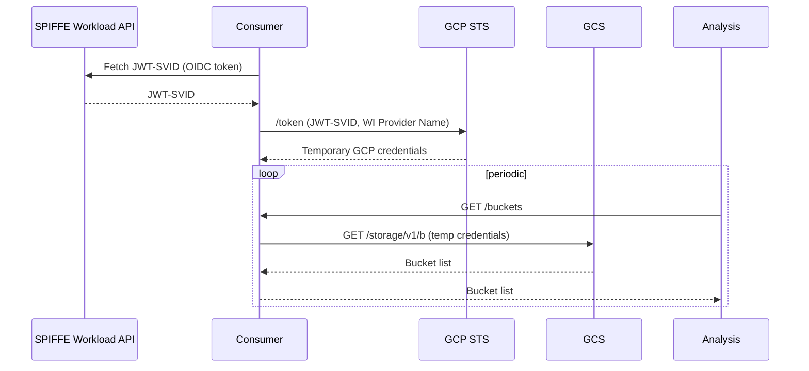

# gcp-oidc

Demonstrates using a SPIFFE JWT-SVID to authenticate to GCP via Workload Identity Federation (WIF), exchanging a workload's SPIFFE identity for temporary GCP credentials without static secrets.

## What it demonstrates

The **consumer** workload uses its SPIFFE JWT-SVID as an OIDC token to call GCP STS `/token` endpoint, which returns short-lived GCP credentials scoped to a principal under the selected Workload Identity Pool (identified by the pool and SPIFFE ID). It then uses those credentials to call the GCS API and list buckets.

The **analysis** workload periodically calls the consumer's `/buckets` HTTP endpoint and logs the results.

Optionally, the connection between the two workloads can be secured with SPIFFE mTLS (`ENABLE_TLS=true`), in which case each side validates the other's X.509 SVID.

This pattern shows that SPIFFE identity can be used to authenticate to cloud provider APIs, eliminating the need to distribute long-lived GCP service account keys to workloads.



### GCP setup

A Workload Identity Provider must be configured in GCP IAM pointing at the SPIRE server's JWKS endpoint. Additionally, provider's principals must be assigned the required roles to perform their operations. Example Terraform configuration for this is provided in the `terraform/` directory.

## Configuration

### Consumer (server — `gcp-oidc-consumer`)

Runs in the `production` namespace, listens on `:9090`.

| Variable | Required | Default | Description |
|----------|----------|---------|-------------|
| `GCP_WORKLOAD_IDENTITY_PROVIDER` | Yes | — | Full path (name) of the Workload Identity Provider resource to use for authentication |
| `GCP_PROJECT_ID` | Yes | — | The ID (*not* the number) of the project with buckets to list |
| `ENABLE_TLS` | No | `false` | If `true`, serve mTLS and validate the analysis workload's SVID |
| `ANALYSIS_TRUST_DOMAIN` | No | — | Trust domain of the analysis workload; used to build the expected SPIFFE ID when `ENABLE_TLS` is true |
| `ANALYSIS_SPIFFE_ID` | No | `spiffe://%s/ns/analytics/sa/default` | SPIFFE ID format string for the authorised analysis workload (`%s` is replaced with `ANALYSIS_TRUST_DOMAIN`) |
| `SPIFFE_ENDPOINT_SOCKET` | No | `unix:///spiffe-workload-api/spire-agent.sock` | SPIFFE Workload API socket path |

### Analysis (client — `gcp-oidc-analysis`)

Runs in the `analytics` namespace.

| Variable | Required | Default | Description |
|----------|----------|---------|-------------|
| `CONSUMER_SERVER_ADDRESS` | Yes | — | Base URL of the consumer service (e.g. `http://consumer.production:9090`) |
| `ENABLE_TLS` | No | `false` | If `true`, use mTLS and validate the consumer workload's SVID |
| `CONSUMER_TRUST_DOMAIN` | No | — | Trust domain of the consumer workload; used to build the expected SPIFFE ID when `ENABLE_TLS` is true |
| `CONSUMER_SPIFFE_ID` | No | `spiffe://%s/ns/production/sa/default` | SPIFFE ID format string for the authorised consumer workload (`%s` is replaced with `CONSUMER_TRUST_DOMAIN`) |
| `SPIFFE_ENDPOINT_SOCKET` | No | `unix:///spiffe-workload-api/spire-agent.sock` | SPIFFE Workload API socket path |

## Deployment

### GCP infrastructure

```bash
cd terraform
terraform init
terraform apply
```

This creates the necessary resources to list buckets from the consumer.

### Kubernetes workloads

```bash
export COFIDE_DEMOS_IMAGE_TAG=latest
export COFIDE_DEMOS_IMAGE_PREFIX=ghcr.io/cofide/cofide-demos/
export COFIDE_DEMOS_IMAGE_PULL_POLICY=Always
export CONSUMER_GCP_WORKLOAD_IDENTITY_PROVIDER="projects/1234567890/locations/global/workloadIdentityPools/my-pool/providers/my-provider"
export CONSUMER_GCP_PROJECT_ID="my-project"
export ANALYSIS_TRUST_DOMAIN=example.org
export ANALYSIS_SPIFFE_ID=spiffe://%s/ns/analytics/sa/default
export CONSUMER_TRUST_DOMAIN=example.org
export CONSUMER_SERVER_ADDRESS=http://consumer.production:9090
export CONSUMER_SPIFFE_ID=spiffe://%s/ns/production/sa/default
export CONSUMER_SERVICE_TYPE=ClusterIP

envsubst < gcp-oidc-consumer/deploy.yaml | kubectl apply -f -
envsubst < gcp-oidc-analysis/deploy.yaml | kubectl apply -f -
```

The consumer is deployed to the `production` namespace and the analysis workload to the `analytics` namespace. Both manifests mount the SPIFFE Workload API socket via the `csi.spiffe.io` CSI driver.
