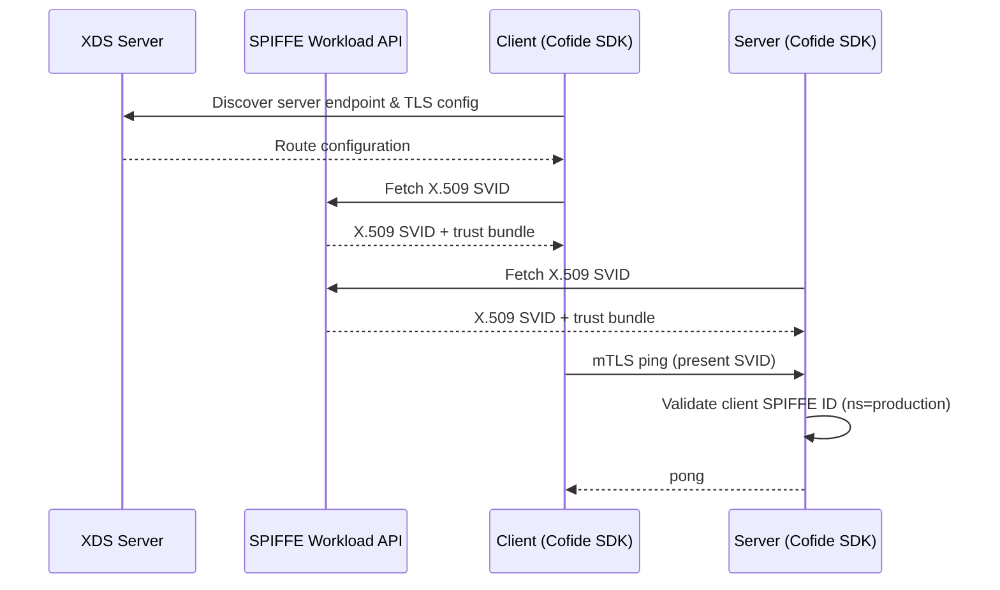

# ping-pong-cofide

Demonstrates SPIFFE mTLS using the [Cofide Go SDK](https://github.com/cofide/cofide-sdk-go), with XDS-based service discovery for the client.

## What it demonstrates

This variant is functionally similar to the base `ping-pong` demo — workloads authenticate via mTLS with X.509 SVIDs — but uses the Cofide SDK abstractions rather than `go-spiffe` directly:

- The **server** wraps `http.Server` with `cofide_http_server.NewServer`, which handles SVID management and mTLS automatically. It authorises clients whose SPIFFE ID has the path segment `ns=production`. It also runs a plain HTTP server on `:8080` for insecure access.
- The **client** uses `cofidehttp.NewClient` with XDS service discovery, connecting to an XDS server to resolve routing and TLS configuration rather than hardcoding server addresses.

This demonstrates the Cofide SDK's higher-level API for building SPIFFE-aware services, including dynamic service discovery via xDS.



## Configuration

### Server

| Variable | Required | Default | Description |
|----------|----------|---------|-------------|
| `SECURE_PORT` | No | `:8443` | mTLS listen address |
| `INSECURE_PORT` | No | `:8080` | Plain HTTP listen address |
| `SPIFFE_ENDPOINT_SOCKET` | No | `unix:///spiffe-workload-api/spire-agent.sock` | SPIFFE Workload API socket path |

The server does not require explicit SPIFFE configuration — the Cofide SDK discovers the Workload API socket automatically via the `SPIFFE_ENDPOINT_SOCKET` environment variable or default path.

### Client

| Variable | Required | Default | Description |
|----------|----------|---------|-------------|
| `XDS_SERVER_URI` | Yes | — | URI of the XDS server for service discovery (e.g. `xds://xds.example.org:443`) |
| `PING_PONG_SERVICE_HOST` | No | `ping-pong-server.demo` | Server hostname |
| `PING_PONG_SERVICE_PORT` | No | `8443` | Server port |
| `XDS_NODE_ID` | No | `node` | XDS node ID |
| `SPIFFE_ENDPOINT_SOCKET` | No | `unix:///spiffe-workload-api/spire-agent.sock` | SPIFFE Workload API socket path |

## Deployment

```bash
export IMAGE_TAG=latest
export XDS_SERVER_URI=xds://xds.example.org:443
export PING_PONG_SERVER_SERVICE_HOST=ping-pong-server.demo
export PING_PONG_SERVER_SERVICE_PORT=8443

envsubst < ping-pong-cofide-server/deploy.yaml | kubectl apply -f -
envsubst < ping-pong-cofide-client/deploy.yaml | kubectl apply -f -
```

The server manifest mounts the SPIFFE Workload API socket via the `csi.spiffe.io` CSI driver and exposes ports 8443 (mTLS) and 8080 (HTTP) as a `LoadBalancer` service.
