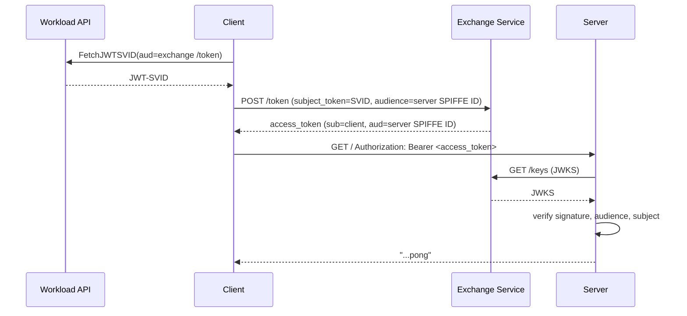
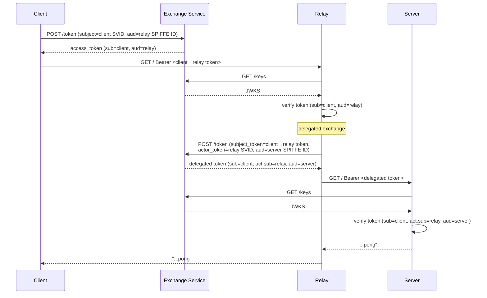

# ping-pong-exchange

A ping-pong demo that demonstrates cross-trust-domain workload authentication using OAuth 2.0 Token Exchange ([RFC 8693](https://www.rfc-editor.org/rfc/rfc8693)) with SPIFFE JWT-SVIDs.

## What it demonstrates

Instead of using mTLS, workloads authenticate by exchanging their SPIFFE JWT-SVID for an OAuth 2.0 access token at a central token exchange service. This allows workloads in different trust domains to authenticate to each other without requiring direct trust between the domains — only the token exchange service needs to be trusted by both sides.

The demo supports three operating modes:

- **client**: Periodically sends a ping to a server. Before each request, the client fetches its JWT-SVID from the SPIFFE Workload API, exchanges it for an access token scoped to the server's SPIFFE ID, and sends the token as a `Bearer` credential.
- **server**: Receives ping requests. Validates the `Bearer` token by fetching the token exchange service's JWKS, verifying the signature, checking the audience matches its own SPIFFE ID, and checking the subject matches the expected client SPIFFE ID. Responds with `...pong`.
- **relay**: Combines both roles. Accepts authenticated ping requests from a client (acting as a server), then performs a delegated token exchange — presenting the incoming access token as the subject token and its own JWT-SVID as the actor token — and forwards the ping to a downstream server. This demonstrates [RFC 8693 impersonation/delegation](https://www.rfc-editor.org/rfc/rfc8693#section-1.1) across a chain of services.

### Token exchange flow



### Relay (delegated token) flow

When a relay sits between the client and the server, it performs a delegated token exchange ([RFC 8693 §1.1](https://www.rfc-editor.org/rfc/rfc8693#section-1.1)), combining the incoming subject token with its own JWT-SVID as the actor token. The resulting token carries both a `sub` (original client) and an `act.sub` (relay), so the server can verify the full delegation chain.



The token exchange service must implement:
- `POST /token` — RFC 8693 token exchange endpoint
- `GET /keys` — JWKS endpoint for token verification

## Configuration

### Environment variables

| Variable | Required | Default | Description |
|----------|----------|---------|-------------|
| `PING_PONG_MODE` | Yes | — | Operating mode: `client`, `server`, or `relay` |
| `EXCHANGE_URL` | Yes | — | Base URL of the OAuth 2.0 token exchange service (e.g. `https://exchange.example.com`). The `/token` and `/keys` paths are appended automatically. |
| `ACTOR_SPIFFE_ID` | No | — | SPIFFE ID of the expected actor in delegated tokens. When set, the server requires the token to contain an `act` claim (RFC 8693 §4.4) whose `sub` matches this value. |
| `CLIENT_SPIFFE_ID` | server, relay | — | SPIFFE ID of the client workload to authorize (e.g. `spiffe://trust-domain-a/client`) |
| `SERVER_SPIFFE_ID` | client, relay | — | SPIFFE ID of the downstream server, used as the token audience (e.g. `spiffe://trust-domain-b/server`) |
| `PING_PONG_SERVICE_HOST` | client, relay | `ping-pong-server.demo` | Hostname of the downstream server |
| `PING_PONG_SERVICE_PORT` | client, relay | `8443` | Port of the downstream server |
| `PING_PONG_SERVER_LISTEN_ADDRESS` | server, relay | `:8443` | Address to listen on |
| `SPIFFE_ENDPOINT_SOCKET` | No | `unix:///spiffe-workload-api/spire-agent.sock` | Path to the SPIFFE Workload API socket |

## Deployment

The workload expects access to a SPIFFE Workload API socket, provided by the `csi.spiffe.io` CSI driver in the Kubernetes manifests.

### Build

```bash
just build-ping-pong-exchange
```

Or directly with `ko`:

```bash
KO_DOCKER_REPO=ghcr.io/cofide/cofide-demos ko build ./workloads/ping-pong-exchange
```

### Deploy to Kubernetes

The `deploy-*.yaml` manifests use shell-style variable substitution for environment-specific values. Substitute the variables before applying, for example with `envsubst`:

```bash
export IMAGE_TAG=latest
export EXCHANGE_URL=https://exchange.example.com
export CLIENT_SPIFFE_ID=spiffe://trust-domain-a/ns/demo/sa/ping-pong-client
export SERVER_SPIFFE_ID=spiffe://trust-domain-b/ns/demo/sa/ping-pong-server
export PING_PONG_SERVER_SERVICE_HOST=ping-pong-server.demo
export PING_PONG_SERVER_SERVICE_PORT=8443

envsubst < deploy-server.yaml | kubectl apply -f -
envsubst < deploy-client.yaml | kubectl apply -f -
```

To deploy the relay topology (client → relay → server):

```bash
# CLIENT_SPIFFE_ID and SERVER_SPIFFE_ID refer to the relay's client/server respectively
envsubst < deploy-relay.yaml | kubectl apply -f -
```

### Manifest summary

| Manifest | Mode | Creates |
|----------|------|---------|
| `deploy-client.yaml` | `client` | ServiceAccount, Deployment |
| `deploy-server.yaml` | `server` | ServiceAccount, Service (port 8443), Deployment |
| `deploy-relay.yaml` | `relay` | ServiceAccount, Service (port 8443), Deployment |
