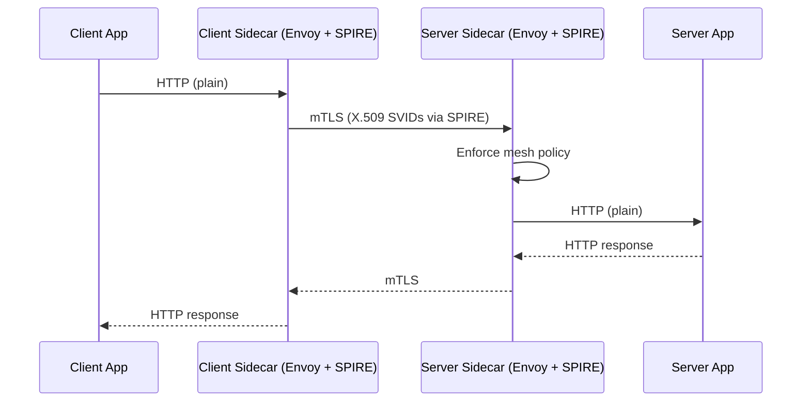

# ping-pong-mesh

A ping-pong demo with no application-level authentication, intended to run behind a service mesh that enforces mTLS at the sidecar layer.

## What it demonstrates

The workloads themselves are plain HTTP — no SPIFFE, no TLS, no credential handling in application code. Authentication and encryption are delegated entirely to the mesh (Istio). The deploy manifests include Istio sidecar injection annotations to attach SPIRE-aware Envoy sidecars to each pod.

This pattern shows that existing applications can gain strong workload identity without code changes, by running them inside a mesh that handles identity at the infrastructure layer.



## Configuration

### Server

| Variable | Required | Default | Description |
|----------|----------|---------|-------------|
| `PORT` | No | `:8443` | Listen address |

### Client

| Variable | Required | Default | Description |
|----------|----------|---------|-------------|
| `PING_PONG_SERVICE_HOST` | Yes | — | Server hostname |
| `PING_PONG_SERVICE_PORT` | Yes | — | Server port |

## Deployment

```bash
export IMAGE_TAG=latest
export PING_PONG_SERVER_SERVICE_HOST=ping-pong-server.demo
export PING_PONG_SERVER_SERVICE_PORT=8443

envsubst < ping-pong-mesh-server/deploy.yaml | kubectl apply -f -
envsubst < ping-pong-mesh-client/deploy.yaml | kubectl apply -f -
```

The manifests include Istio sidecar injection annotations (`sidecar.istio.io/inject: "true"`) and configure the `spire` injection template alongside the standard `sidecar` template, so SPIRE-issued SVIDs are used for mTLS between the sidecars. Istio and SPIRE must already be installed and configured in the cluster.
