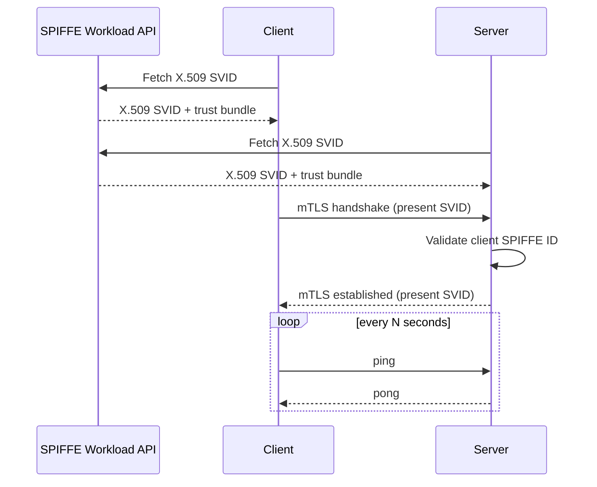

# ping-pong

The reference ping-pong demo. Demonstrates workload-to-workload authentication using SPIFFE mTLS with X.509 SVIDs. Both client and server expose Prometheus metrics.

## What it demonstrates

The client and server establish mutual TLS using X.509 SVIDs obtained from the SPIFFE Workload API. The server authorises connections from a configurable list of client SPIFFE IDs; any other identity is rejected at the TLS handshake. Neither workload manages certificates — they are rotated automatically by the SPIRE agent and picked up via the `X509Source`.

Both workloads expose Prometheus metrics including request counts, SVID expiry timestamps, and SVID URI SANs.



## Configuration

### Server

| Variable | Required | Default | Description |
|----------|----------|---------|-------------|
| `CLIENT_SPIFFE_IDS` | Yes | — | Comma-separated list of SPIFFE IDs authorised to connect (e.g. `spiffe://example.org/client`) |
| `PORT` | No | `:8443` | mTLS listen address |
| `METRICS_PORT` | No | `:8080` | Prometheus metrics listen address |
| `METRICS_ENABLED` | No | `true` | Enable Prometheus metrics |
| `SPIFFE_ENDPOINT_SOCKET` | No | `unix:///spiffe-workload-api/spire-agent.sock` | SPIFFE Workload API socket path |

### Client

| Variable | Required | Default | Description |
|----------|----------|---------|-------------|
| `PING_PONG_SERVICE_HOST` | No | `ping-pong-server.demo` | Server hostname |
| `PING_PONG_SERVICE_PORT` | No | `8443` | Server port |
| `METRICS_PORT` | No | `:8080` | Prometheus metrics listen address |
| `METRICS_ENABLED` | No | `true` | Enable Prometheus metrics |
| `SPIFFE_ENDPOINT_SOCKET` | No | `unix:///spiffe-workload-api/spire-agent.sock` | SPIFFE Workload API socket path |

## Deployment

Deploy using `envsubst` to substitute variables into the manifests:

```bash
export COFIDE_DEMOS_IMAGE_TAG=latest
export COFIDE_DEMOS_IMAGE_PREFIX=ghcr.io/cofide/cofide-demos/
export COFIDE_DEMOS_IMAGE_PULL_POLICY=Always
export CLIENT_SPIFFE_IDS=spiffe://example.org/ns/demo/sa/ping-pong-client
export PING_PONG_SERVER_SERVICE_HOST=ping-pong-server.demo
export PING_PONG_SERVER_SERVICE_PORT=8443

envsubst < ping-pong-server/deploy.yaml | kubectl apply -f -
envsubst < ping-pong-client/deploy.yaml | kubectl apply -f -
```

The manifests mount the SPIFFE Workload API socket via the `csi.spiffe.io` CSI driver. The server is exposed as a `LoadBalancer` service on port 8443.
